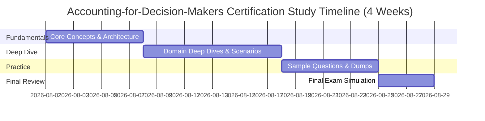

# Accounting for Decision Makers Exam Prep (`Accounting-for-Decision-Makers`)

Master the skills required to excel in the **Accounting for Decision Makers** exam offered by **WGU**.

## Technical Demo Practice Questions

Review these 10 representative sample questions to benchmark your technical preparation.

### Question 1
**In the context of Accounting for Decision Makers, which core objective is emphasized in the domain of Financial Accounting Fundamentals & Statements?**

- A. Standardizing framework principles and applying best-practice operational methodologies
- B. Eliminating all documentation in favor of unverified deployment
- C. Relying exclusively on single-point-of-failure infrastructure
- D. Bypassing governance and compliance audits

**Correct Answer**: `A. Standardizing framework principles and applying best-practice operational methodologies`

**Explanation**: Competency in Financial Accounting Fundamentals & Statements requires mastering industry-standard frameworks, analytical principles, and practical application skills.

---

### Question 2
**Which foundational concept in Accounting-for-Decision-Makers ensures data integrity and operational reliability across systems?**

- A. Defense-in-depth and structured verification controls
- B. Storing unencrypted passwords in plaintext configuration files
- C. Ignoring audit logs and monitoring alerts
- D. Disabling role-based access control (RBAC)

**Correct Answer**: `A. Defense-in-depth and structured verification controls`

**Explanation**: System stability and data assurance rely on multi-layered verification, role-based controls, and continuous monitoring.

---

### Question 3
**Which methodology or analytical approach is recommended when addressing complex problems within Budgeting, Variance Analysis & Performance Evaluation?**

- A. Systematic root-cause analysis and data-driven evaluation
- B. Trial-and-error changes made directly in live operational settings
- C. Ignoring stakeholder feedback and historical performance metrics
- D. Relying strictly on obsolete legacy standards

**Correct Answer**: `A. Systematic root-cause analysis and data-driven evaluation`

**Explanation**: Effective management and engineering in Budgeting, Variance Analysis & Performance Evaluation demand empirical analysis, structured problem solving, and evidence-based decision making.

---

### Question 4
**In the context of Accounting for Decision Makers, which core objective is emphasized in the domain of Internal Controls & Ethics in Accounting?**

- A. Standardizing framework principles and applying best-practice operational methodologies
- B. Eliminating all documentation in favor of unverified deployment
- C. Relying exclusively on single-point-of-failure infrastructure
- D. Bypassing governance and compliance audits

**Correct Answer**: `A. Standardizing framework principles and applying best-practice operational methodologies`

**Explanation**: Competency in Internal Controls & Ethics in Accounting requires mastering industry-standard frameworks, analytical principles, and practical application skills.

---

### Question 5
**Which foundational concept in Accounting-for-Decision-Makers ensures data integrity and operational reliability across systems?**

- A. Defense-in-depth and structured verification controls
- B. Storing unencrypted passwords in plaintext configuration files
- C. Ignoring audit logs and monitoring alerts
- D. Disabling role-based access control (RBAC)

**Correct Answer**: `A. Defense-in-depth and structured verification controls`

**Explanation**: System stability and data assurance rely on multi-layered verification, role-based controls, and continuous monitoring.

---

### Question 6
**Which methodology or analytical approach is recommended when addressing complex problems within Managerial Accounting & Cost-Volume-Profit (CVP)?**

- A. Systematic root-cause analysis and data-driven evaluation
- B. Trial-and-error changes made directly in live operational settings
- C. Ignoring stakeholder feedback and historical performance metrics
- D. Relying strictly on obsolete legacy standards

**Correct Answer**: `A. Systematic root-cause analysis and data-driven evaluation`

**Explanation**: Effective management and engineering in Managerial Accounting & Cost-Volume-Profit (CVP) demand empirical analysis, structured problem solving, and evidence-based decision making.

---

### Question 7
**In the context of Accounting for Decision Makers, which core objective is emphasized in the domain of Financial Accounting Fundamentals & Statements?**

- A. Standardizing framework principles and applying best-practice operational methodologies
- B. Eliminating all documentation in favor of unverified deployment
- C. Relying exclusively on single-point-of-failure infrastructure
- D. Bypassing governance and compliance audits

**Correct Answer**: `A. Standardizing framework principles and applying best-practice operational methodologies`

**Explanation**: Competency in Financial Accounting Fundamentals & Statements requires mastering industry-standard frameworks, analytical principles, and practical application skills.

---

### Question 8
**Which foundational concept in Accounting-for-Decision-Makers ensures data integrity and operational reliability across systems?**

- A. Defense-in-depth and structured verification controls
- B. Storing unencrypted passwords in plaintext configuration files
- C. Ignoring audit logs and monitoring alerts
- D. Disabling role-based access control (RBAC)

**Correct Answer**: `A. Defense-in-depth and structured verification controls`

**Explanation**: System stability and data assurance rely on multi-layered verification, role-based controls, and continuous monitoring.

---

### Question 9
**Which methodology or analytical approach is recommended when addressing complex problems within Budgeting, Variance Analysis & Performance Evaluation?**

- A. Systematic root-cause analysis and data-driven evaluation
- B. Trial-and-error changes made directly in live operational settings
- C. Ignoring stakeholder feedback and historical performance metrics
- D. Relying strictly on obsolete legacy standards

**Correct Answer**: `A. Systematic root-cause analysis and data-driven evaluation`

**Explanation**: Effective management and engineering in Budgeting, Variance Analysis & Performance Evaluation demand empirical analysis, structured problem solving, and evidence-based decision making.

---

### Question 10
**In the context of Accounting for Decision Makers, which core objective is emphasized in the domain of Internal Controls & Ethics in Accounting?**

- A. Standardizing framework principles and applying best-practice operational methodologies
- B. Eliminating all documentation in favor of unverified deployment
- C. Relying exclusively on single-point-of-failure infrastructure
- D. Bypassing governance and compliance audits

**Correct Answer**: `A. Standardizing framework principles and applying best-practice operational methodologies`

**Explanation**: Competency in Internal Controls & Ethics in Accounting requires mastering industry-standard frameworks, analytical principles, and practical application skills.

---

## Domain Breakdown & Exam Specifications

### Exam Specifications
- **Exam Title**: Accounting for Decision Makers
- **Exam Code**: `Accounting-for-Decision-Makers`
- **Vendor**: WGU
- **Exam Duration**: 120 Minutes
- **Number of Questions**: 70
- **Passing Score**: 70%

### Domain Weights Table
| Domain / Objective | Weight |
| :--- | :--- |
| Financial Accounting Fundamentals & Statements | 35% |
| Managerial Accounting & Cost-Volume-Profit (CVP) | 30% |
| Budgeting, Variance Analysis & Performance Evaluation | 20% |
| Internal Controls & Ethics in Accounting | 15% |

## Recommended Study Schedule

## Exam Preparation Resources

Leverage official vendor documentation alongside target practice assessments. Access the latest [Accounting-for-Decision-Makers exam prep](https://www.certsclub.com) to refine your test strategies and guarantee a passing score on exam day.
